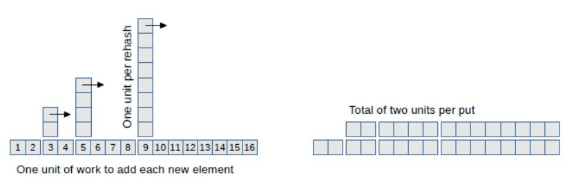
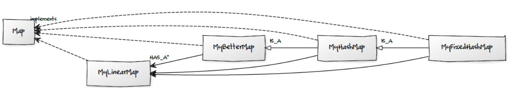

# 第十一章 `HashMap`

> 原文：[Chapter 11  HashMap](http://greenteapress.com/thinkdast/html/thinkdast012.html)

> 译者：[飞龙](https://github.com/wizardforcel)

> 协议：[CC BY-NC-SA 4.0](http://creativecommons.org/licenses/by-nc-sa/4.0/)

> 自豪地采用[谷歌翻译](https://translate.google.cn/)

上一章中，我们写了一个使用哈希的`Map`接口的实现。我们期望这个版本更快，因为它搜索的列表较短，但增长顺序仍然是线性的。

如果存在`n`个条目和`k`个子映射，则子映射的大小平均为`n/k`，这仍然与`n`成正比。但是，如果我们与`n`一起增加`k`，我们可以限制`n/k`的大小。

例如，假设每次`n`超过`k`的时候，我们都使`k`加倍；在这种情况下，每个映射的条目的平均数量将小于`1`，并且几乎总是小于`10`，只要散列函数能够很好地展开键。


如果每个子映射的条目数是不变的，我们可以在常数时间内搜索一个子映射。并且计算散列函数通常是常数时间（它可能取决于键的大小，但不取决于键的数量）。这使得`Map`的核心方法， `put`和`get`时间不变。

在下一个练习中，你将看到细节。

## 11.1 练习 9

在`MyHashMap.java`中，我提供了哈希表的大纲，它会按需增长。这里是定义的起始：

```java
public class MyHashMap<K, V> extends MyBetterMap<K, V> implements Map<K, V> {

    // average number of entries per sub-map before we rehash
    private static final double FACTOR = 1.0;

    @Override
    public V put(K key, V value) {
        V oldValue = super.put(key, value);

        // check if the number of elements per sub-map exceeds the threshold
        if (size() > maps.size() * FACTOR) {
            rehash();
        }
        return oldValue;
    }
}
```

`MyHashMap`扩展了`MyBetterMap`，所以它继承了那里定义的方法。它覆盖的唯一方法是`put`，它调用了超类中的`put` -- 也就是说，它调用了`MyBetterMap `中的`put`版本 -- 然后它检查它是否必须`rehash`。调用`size`返回总数量`n`。调用`maps.size`返回内嵌映射的数量`k`。

常数`FACTOR`（称为负载因子）确定每个子映射的平均最大条目数。如果`n > k * FACTOR`，这意味着`n/k > FACTOR`，意味着每个子映射的条目数超过阈值，所以我们调用`rehash`。


运行`ant build`来编译源文件。然后运行`ant MyHashMapTest`。它应该失败，因为执行`rehash`会抛出异常。你的工作是填充它。


填充`rehash`的主体，来收集表中的条目，调整表的大小，然后重新放入条目。我提供了两种可能会派上用场的方法：`MyBetterMap.makeMaps`和`MyLinearMap.getEntries`。每次调用它时，你的解决方案应该使映射数量加倍。

## 11.2 分析`MyHashMap`

如果最大子映射中的条目数与`n/k`成正比，并且`k`与`n`成正比，那么多个核心方法就是常数时间的：

```java
    public boolean containsKey（Object target）{ 
        MyLinearMap <K，V> map = chooseMap（target）; 
        return map.containsKey（target）; 
    } 

    public V get（Object key）{ 
        MyLinearMap <K，V> map = chooseMap（key）; return map.get（key）; 
    } 
    public V remove（Object key）{ 
        MyLinearMap <K，V> map = chooseMap（key）; 
        return map.remove（key）; 
    }
```

每个方法都计算键的哈希，这是常数时间，然后在一个子映射上调用一个方法，这个方法是常数时间的。

到现在为止还挺好。但另一个核心方法，`put`有点难分析。当我们不需要`rehash`时，它是不变的时间，但是当我们这样做时，它是线性的。这样，它与 3.2 节中我们分析的`ArrayList.add`类似。


出于同样的原因，如果我们平摊一系列的调用，结果是常数时间。同样，论证基于摊销分析（见 3.2 节）。


假设子映射的初始数量`k`为`2`，负载因子为`1`。现在我们来看看`put`一系列的键需要多少工作量。作为基本的“工作单位”，我们将计算对密钥哈希，并将其添加到子映射中的次数。


我们第一次调用`put`时，它需要`1`个工作单位。第二次也需要`1`个单位。第三次我们需要`rehash`，所以需要`2`个单位重新填充现有的键，和`1`个单位来对新键哈希。

> 译者注：可以单独计算`rehash`中转移元素的数量，然后将元素转移的复杂度和计算哈希的复杂度相加。

现在哈希表的大小是`4`，所以下次调用`put`时 ，需要`1`个工作单位。但是下一次我们必须`rehash`，需要`4`个单位来`rehash`现有的键，和`1`个单位来对新键哈希。


图 11.1 展示了规律，对新键哈希的正常工作量在底部展示，额外工作量展示为塔楼。



图 11.1：向哈希表添加元素的工作量展示

如箭头所示，如果我们把塔楼推倒，每个积木都会在下一个塔楼之前填满空间。结果似乎`2`个单位的均匀高度，这表明`put`的平均工作量约为`2`个单位。这意味着`put`平均是常数时间。

这个图还显示了，当我们`rehash`的时候，为什么加倍子映射数量`k`很重要。如果我们只是加上`k`而不是加倍，那么这些塔楼会靠的太近，他们会开始堆积。这样就不会是常数时间了。

## 11.3 权衡

我们已经表明，`containsKey`，`get`和`remove`是常数时间，`put`平均为常数时间。我们应该花一点时间来欣赏它有多么出色。无论哈希表有多大，这些操作的性能几乎相同。算是这样吧。


记住，我们的分析基于一个简单的计算模型，其中每个“工作单位”花费相同的时间量。真正的电脑比这更复杂。特别是，当处理足够小，适应高速缓存的数据结构时，它们通常最快；如果结构不适合高速缓存但仍适合内存，则稍慢一点；如果结构不适合在内存中，则非常慢。


这个实现的另一个限制是，如果我们得到了一个值而不是一个键时，那么散列是不会有帮助的：`containsValue`是线性的，因为它必须搜索所有的子映射。查找一个值并找到相应的键（或可能的键），没有特别有效的方式。


还有一个限制：`MyLinearMap`的一些常数时间的方法变成了线性的。例如：

```java
    public void clear() {
        for (int i=0; i<maps.size(); i++) {
            maps.get(i).clear();
        }
    }
```

`clear`必须清除所有的子映射，子映射的数量与`n`成正比，所以它是线性的。幸运的是，这个操作并不常用，所以在大多数应用中，这种权衡是可以接受的。

## 11.4 分析`MyHashMap`

在我们继续之前，我们应该检查一下，`MyHashMap.put`是否真的是常数时间。


运行`ant build`来编译源文件。然后运行`ant ProfileMapPut`。它使用一系列问题规模，测量 `HashMap.put`（由 Java 提供）的运行时间，并在重对数比例尺上绘制运行时间与问题规模。如果这个操作是常数时间，`n`个操作的总时间应该是线性的，所以结果应该是斜率为`1`的直线。当我运行这个代码时，估计的斜率接近`1`，这与我们的分析一致。你应该得到类似的东西。

修改`ProfileMapPut.java`，来测量你的`MyHashMap`实现，而不是 Java 的`HashMap`。再次运行分析器，查看斜率是否接近`1`。你可能需要调整`startN`和`endMillis`，来找到一系列问题规模，其中运行时间多于几毫秒，但不超过几秒。

当我运行这个代码时，我感到惊讶：斜率大约为`1.7`，这表明这个实现不是一直都是常数的。它包含一个“性能错误”。


在阅读下一节之前，你应该跟踪错误，修复错误，并确认现在`put`是常数时间，符合预期。

## 11.5 修复`MyHashMap`

`MyHashMap`的问题是`size`，它继承自`MyBetterMap`：

```java
    public int size() {
        int total = 0;
        for (MyLinearMap<K, V> map: maps) {
            total += map.size();
        }
        return total;
    }
```

为了累计整个大小，它必须迭代子映射。由于我们增加了子映射的数量`k`，随着条目数`n`增加，所以`k`与`n`成正比，所以`size`是线性的。

`put`也是线性的，因为它使用`size`：

```java
    public V put(K key, V value) {
        V oldValue = super.put(key, value);

        if (size() > maps.size() * FACTOR) {
            rehash();
        }
        return oldValue;
    }
```

如果`size`是线性的，我们做的一切都浪费了。

幸运的是，有一个简单的解决方案，我们以前看过：我们必须维护实例变量中的条目数，并且每当我们调用一个改变它的方法时更新它。

你会在这本书的仓库中找到我的解决方案`MyFixedHashMap.java`。这是类定义的起始：

```java
public class MyFixedHashMap<K, V> extends MyHashMap<K, V> implements Map<K, V> {

    private int size = 0;

    public void clear() {
        super.clear();
        size = 0;
    }
```

我们不修改`MyHashMap`，我定义一个扩展它的新类。它添加一个新的实例变量`size`，它被初始化为零。

更新`clear`很简单; 我们在超类中调用`clear`（清除子映射），然后更新`size`。


更新`remove`和`put`有点困难，因为当我们调用超类的该方法，我们不能得知子映射的大小是否改变。这是我的解决方式：

```java
    public V remove(Object key) {
        MyLinearMap<K, V> map = chooseMap(key);
        size -= map.size();
        V oldValue = map.remove(key);
        size += map.size();
        return oldValue;
    }
```

`remove`使用`chooseMap`找到正确的子映射，然后减去子映射的大小。它会在子映射上调用`remove`，根据是否找到了键，它可以改变子映射的大小，也可能不会改变它的大小。但是无论哪种方式，我们将子映射的新大小加到`size`，所以最终的`size`值是正确的。

重写的`put`版本是类似的：

```java
    public V put(K key, V value) {
        MyLinearMap<K, V> map = chooseMap(key);
        size -= map.size();
        V oldValue = map.put(key, value);
        size += map.size();

        if (size() > maps.size() * FACTOR) {
            size = 0;
            rehash();
        }
        return oldValue;
    }
```

我们在这里也有同样的问题：当我们在子地图上调用`put`时，我们不知道是否添加了一个新的条目。所以我们使用相同的解决方案，减去旧的大小，然后加上新的大小。

现在`size`方法的实现很简单了：

```java
    public int size() {
        return size;
    }
```

并且正好是常数时间。

当我测量这个解决方案时，我发现放入`n`个键的总时间正比于`n`，也就是说，每个`put`是常数时间的，符合预期。

## 11.6 UML 类图

在本章中使用代码的一个挑战是，我们有几个互相依赖的类。以下是类之间的一些关系：

+   `MyLinearMap`包含一个`LinkedList`并实现了`Map`。
+   `MyBetterMap`包含许多`MyLinearMap`对象并实现了`Map`。
+   `MyHashMap`扩展了`MyBetterMap`，所以它也包含`MyLinearMap对象`，并实现了`Map`。
+   `MyFixedHashMap`扩展了`MyHashMap`并实现了`Map`。

为了有助于跟踪这些关系，软件工程师经常使用 UML 类图。UML 代表统一建模语言（见 <http://thinkdast.com/uml> ）。“类图”是由 UML 定义的几种图形标准之一。

在类图中，每个类由一个框表示，类之间的关系由箭头表示。图  11.2 显示了使用在线工具 yUML（<http://yuml.me/>）生成的，上一个练习的 UML 类图。



图11.2：本章中的 UML 类图

不同的关系由不同的箭头表示：

+   实心箭头表示 HAS-A 关系。例如，每个`MyBetterMap`实例包含多个`MyLinearMap`实例，因此它们通过实线箭头连接。
+   空心和实线箭头表示 IS-A 关系。例如，`MyHashMap`扩展 了`MyBetterMap`，因此它们通过 IS-A 箭头连接。
+   空心和虚线箭头表示一个类实现了一个接口;在这个图中，每个类都实现 `Map`。

UML 类图提供了一种简洁的方式，来表示大量类集合的信息。在设计阶段中，它们用于交流备选设计，在实施阶段中，用于维护项目的共享思维导图，并在部署过程中记录设计。
