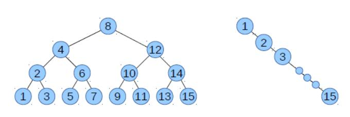

# 第十三章 二叉搜索树

> 原文：[Chapter 13  Binary search tree](http://greenteapress.com/thinkdast/html/thinkdast014.html)

> 译者：[飞龙](https://github.com/wizardforcel)

> 协议：[CC BY-NC-SA 4.0](http://creativecommons.org/licenses/by-nc-sa/4.0/)

> 自豪地采用[谷歌翻译](https://translate.google.cn/)

本章介绍了上一个练习的解决方案，然后测试树形映射的性能。我展示了一个实现的问题，并解释了 Java 的`TreeMap`如何解决它。

## 13.1 简单的`MyTreeMap`

上一个练习中，我给了你`MyTreeMap`的大纲，并让你填充缺失的方法。现在我会展示结果，从`findNode`开始：

```java
private Node findNode(Object target) {
    // some implementations can handle null as a key, but not this one
    if (target == null) {
            throw new IllegalArgumentException();
    }

    // something to make the compiler happy
    @SuppressWarnings("unchecked")
    Comparable<? super K> k = (Comparable<? super K>) target;

    // the actual search
    Node node = root;
    while (node != null) {
        int cmp = k.compareTo(node.key);
        if (cmp < 0)
            node = node.left;
        else if (cmp > 0)
            node = node.right;
        else
            return node;
    }
    return null;
}
```

`findNode`是`containsKey`和`get`所使用的一个私有方法；它不是`Map`接口的一部分。参数`target`是我们要查找的键。我在上一个练习中解释了这种方法的第一部分：

+   在这个实现中，`null`不是键的合法值。
+   在我们可以在`target`上调用`compareTo`之前，我们必须把它强制转换为某种形式的`Comparable`。这里使用的“类型通配符”会尽可能允许；也就是说，它适用于任何实现`Comparable`类型，并且它的`compareTo`接受`K`或者任和`K`的超类。

之后，实际搜索比较简单。我们初始化一个循环变量`node`来引用根节点。每次循环中，我们将目标与`node.key`比较。如果目标小于当前键，我们移动到左子树。如果它更大，我们移动到右子树。如果相等，我们返回当前节点。

如果在没有找到目标的情况下，我们到达树的底部，我就认为，它不在树中并返回`null`。

## 13.2 搜索值

我在前面的练习中解释了，`findNode`运行时间与树的高度成正比，而不是节点的数量，因为我们不必搜索整个树。但是对于`containsValue`，我们必须搜索值，而不是键；BST 的特性不适用于值，因此我们必须搜索整个树。

我的解法是递归的：

```java
public boolean containsValue(Object target) {
    return containsValueHelper(root, target);
}

private boolean containsValueHelper(Node node, Object target) {
    if (node == null) {
        return false;
    }
    if (equals(target, node.value)) {
        return true;
    }
    if (containsValueHelper(node.left, target)) {
        return true;
    }
    if (containsValueHelper(node.right, target)) {
        return true;
    }
    return false;
}
```

`containsValue`将目标值作为参数，并立即调用`containsValueHelper`，传递树的根节点作为附加参数。

这是`containsValueHelper`的工作原理：

+   第一个`if`语句检查递归的边界情况。如果`node`是`null`，那意味着我们已经递归到树的底部，没有找到`target`，所以我们应该返回`false`。请注意，这只意味着目标没有出现在树的一条路径上；它仍然可能会在另一条路径上被发现。
+   第二种情况检查我们是否找到了我们正在寻找的东西。如果是这样，我们返回`true`。否则，我们必须继续。
+   第三种情况是执行递归调用，在左子树中搜索`target`。如果我们找到它，我们可以立即返回`true`，而不搜索右子树。否则我们继续。
+   第四种情况是搜索右子树。同样，如果我们找到我们正在寻找的东西，我们返回`true`。否则，我们搜索完了整棵树，返回`false`。

该方法“访问”了树中的每个节点，所以它的所需时间与节点数成正比。

## 13.3 实现`put`

`put`方法比起`get`要复杂一些，因为要处理两种情况：（1）如果给定的键已经在树中，则替换并返回旧值；（2）否则必须在树中添加一个新的节点，在正确的地方。


在上一个练习中，我提供了这个起始代码：

```java
public V put(K key, V value) {
    if (key == null) {
        throw new IllegalArgumentException();
    }
    if (root == null) {
        root = new Node(key, value);
        size++;
        return null;
    }
    return putHelper(root, key, value);
}
```

并且让你填充`putHelper`。这里是我的答案：

```java
private V putHelper(Node node, K key, V value) {
    Comparable<? super K> k = (Comparable<? super K>) key;
    int cmp = k.compareTo(node.key);

    if (cmp < 0) {
        if (node.left == null) {
            node.left = new Node(key, value);
            size++;
            return null;
        } else {
            return putHelper(node.left, key, value);
        }
    }
    if (cmp > 0) {
        if (node.right == null) {
            node.right = new Node(key, value);
            size++;
            return null;
        } else {
            return putHelper(node.right, key, value);
        }
    }
    V oldValue = node.value;
    node.value = value;
    return oldValue;
}
```

第一个参数`node`最初是树的根，但是每次我们执行递归调用，它指向了不同的子树。就像`get`一样，我们用`compareTo`方法来弄清楚，跟随哪一条树的路径。如果`cmp < 0`，我们添加的键小于`node.key`，那么我们要走左子树。有两种情况：

+   如果左子树为空，那就是，如果`node.left`是`null`，我们已经到达树的底部而没有找到`key`。这个时候，我们知道`key`不在树上，我们知道它应该放在哪里。所以我们创建一个新节点，并将它添加为`node`的左子树。
+   否则我们进行递归调用来搜索左子树。

如果`cmp > 0`，我们添加的键大于`node.key`，那么我们要走右子树。我们处理的两个案例与上一个分支相同。最后，如果`cmp == 0`，我们在树中找到了键，那么我们更改它并返回旧的值。

我使用递归编写了这个方法，使它更易于阅读，但它可以直接用迭代重写一遍，你可能想留作练习。

## 13.4 中序遍历

我要求你编写的最后一个方法是`keySet`，它返回一个`Set`，按升序包含树中的键。在其他`Map`实现中，`keySet`返回的键没有特定的顺序，但是树形实现的一个功能是，对键进行简单而有效的排序。所以我们应该利用它。

这是我的答案：

```java
public Set<K> keySet() {
    Set<K> set = new LinkedHashSet<K>();
    addInOrder(root, set);
    return set;
}

private void addInOrder(Node node, Set<K> set) {
    if (node == null) return;
    addInOrder(node.left, set);
    set.add(node.key);
    addInOrder(node.right, set);        
}
```

在`keySet`中，我们创建一个`LinkedHashSet`，这是一个`Set`实现，使元素保持有序（与大多数其他`Set`实现不同）。然后我们调用`addInOrder`来遍历树。

第一个参数`node`最初是树的根，但正如你的期望，我们用它来递归地遍历树。`addInOrder`对树执行经典的“中序遍历”。

如果`node`是`null`，这意味着子树是空的，所以我们返回，而不向`set`添加任何东西。否则我们：

1.  按顺序遍历左子树。
1.  添加`node.key`。
1.  按顺序遍历右子树。

请记住，BST 的特性保证左子树中的所有节点都小于`node.key`，并且右子树中的所有节点都更大。所以我们知道，`node.key`已按正确的顺序添加。

递归地应用相同的参数，我们知道左子树中的元素是有序的，右子树中的元素也一样。并且边界情况是正确的：如果子树为空，则不添加任何键。所以我们可以认为，该方法以正确的顺序添加所有键。

因为`containsValue`方法访问树中的每个节点，所以所需时间与`n`成正比。

## 13.5 对数时间的方法

在`MyTreeMap`中，`get`和`put`方法所需时间与树的高度`h`成正比。在上一个练习中，我们展示了如果树是满的 - 如果树的每一层都包含最大数量的节点 - 树的高度与`log n`成横臂。


我也说了，`get`和`put`是对数时间的；也就是说，他们的所需时间与`logn`成正比。但是对于大多数应用程序，不能保证树是满的。一般来说，树的形状取决于键和添加顺序。

为了看看这在实践中是怎么回事，我们将用两个样本数据集来测试我们的实现：随机字符串的列表和升序的时间戳列表。


这是生成随机字符串的代码：

```java
Map<String, Integer> map = new MyTreeMap<String, Integer>();

for (int i=0; i<n; i++) {
    String uuid = UUID.randomUUID().toString();
    map.put(uuid, 0);
}
```

`UUID`是`java.util`中的类，可以生成随机的“通用唯一标识符”。UUID 对于各种应用是有用的，但在这个例子中，我们利用一种简单的方法来生成随机字符串。

我使用`n=16384`来运行这个代码，并测量了最后的树的运行时间和高度。以下是输出：

```
Time in milliseconds = 151
Final size of MyTreeMap = 16384
log base 2 of size of MyTreeMap = 14.0
Final height of MyTreeMap = 33
```

我包含了“`MyTreeMap`大小的`2`为底的对数”，看看如果它已满，树将是多高。结果表明，高度为`14`的完整树包含`16384`个节点。

随机字符串的树高度实际为33，这远大于理论上的最小值，但不是太差。要查找`16,384`个键中的一个，我们只需要进行`33`次比较。与线性搜索相比，速度快了近`500`倍。

这种性能通常是随机字符串，或其他不按照特定顺序添加的键。树的最终高度可能是理论最小值的`2~3`倍，但它仍然与`log n`成正比，这远小于`n`。事实上，随着`n`的增加，`logn`会慢慢增加，在实践中，可能很难将对数时间与常数时间区分开。


然而，二叉搜索树并不总是表现良好。让我们看看，当我们以升序添加键时会发生什么。下面是一个示例，以微秒为单位测量时间戳，并将其用作键：

```java
MyTreeMap<String, Integer> map = new MyTreeMap<String, Integer>();

for (int i=0; i<n; i++) {
    String timestamp = Long.toString(System.nanoTime());
    map.put(timestamp, 0);
}
```

`System.nanoTime`返回一个`long`类型的整数，表示以微秒为单位的启动时间。每次我们调用它时，我们得到一个更大的数字。当我们将这些时间戳转换为字符串时，它们按字典序增加。

让我们看看当我们运行它时会发生什么：

```java
Time in milliseconds = 1158
Final size of MyTreeMap = 16384
log base 2 of size of MyTreeMap = 14.0
Final height of MyTreeMap = 16384
```

运行时间是以前的时间的七倍多。时间更长。如果你想知道为什么，看看树的最后的高度：`16384`！



图 13.1：二叉搜索树，平衡（左边）和不平衡（右边）

如果你思考`put`如何工作，你可以弄清楚发生了什么。每次添加一个新的键时，它都大于树中的所有键，所以我们总是选择右子树，并且总是将新节点添加为，最右边的节点的右子节点。结果是一个“不平衡”的树，只包含右子节点。

这种树的高度正比于`n`，不是`logn`，所以`get`和`put`的性能是线性的，不是对数的。


图 13.1 显示了平衡和不平衡树的示例。在平衡树中，高度为`4`，节点总数为`2^4 - 1 = 15`。在节点数相同的不平衡树中，高度为`15`。

## 13.6 自平衡树

这个问题有两种可能的解决方案：

你可以避免向`Map`按顺序添加键。但这并不总是可能的。
你可以制作一棵树，如果碰巧按顺序处理键，那么它会更好地处理键。

第二个解决方案是更好的，有几种方法可以做到。最常见的是修改`put`，以便它检测树何时开始变得不平衡，如果是，则重新排列节点。具有这种能力的树被称为“自平衡树”。普通的自平衡树包括 AVL 树（“AVL”是发明者的缩写），以及红黑树，这是 Java`TreeMap`所使用的。

在我们的示例代码中，如果我们用 Java 的`MyTreeMap`替换，随机字符串和时间戳的运行时间大致相同。实际上，时间戳运行速度更快，即使它们有序，可能是因为它们花费的时间较少。


总而言之，二叉搜索树可以以对数时间实现`get`和`put`，但是只能按照使得树足够平衡的顺序添加键。自平衡树通过每次添加新键时，进行一些额外的工作来避免这个问题。

你可以在 <http://thinkdast.com/balancing> 上阅读自平衡树的更多信息。

## 13.7 更多练习

在上一个练习中，你不必实现`remove`，但你可能需要尝试。如果从树中央删除节点，则必须重新排列剩余的节点，来恢复 BST 的特性。你可以自己弄清楚如何实现，或者你可以阅读 <http://thinkdast.com/bstdel> 上的说明。

删除一个节点并重新平衡一个树是类似的操作：如果你做这个练习，你将更好地了解自平衡树如何工作。
