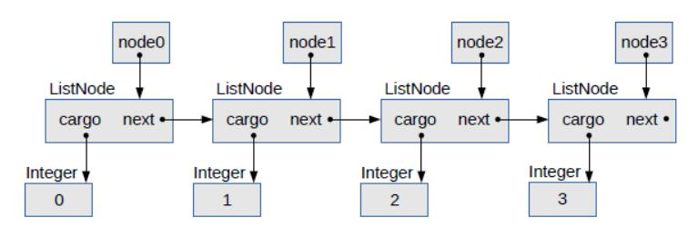

# 第三章 `ArrayList`

> 原文：[Chapter 3  ArrayList](http://greenteapress.com/thinkdast/html/thinkdast004.html)

> 译者：[飞龙](https://github.com/wizardforcel)

> 协议：[CC BY-NC-SA 4.0](http://creativecommons.org/licenses/by-nc-sa/4.0/)

> 自豪地采用[谷歌翻译](https://translate.google.cn/)

本章一举两得：我展示了上一个练习的解法，并展示了一种使用摊销分析来划分算法的方法。

## 3.1 划分`MyArrayList`的方法

对于许多方法，我们不能通过测试代码来确定增长级别。例如，这里是`MyArrayList`的`get`的实现：

```java
public E get(int index) {
    if (index < 0 || index >= size) {
        throw new IndexOutOfBoundsException();
    }
    return array[index];
}
```

`get`中的每个东西都是常数时间的。所以`get`是常数时间，没问题。

现在我们已经划分了`get`，我们可以使用它来划分`set`。这是我们以前的练习中的`set`：

```java
public E set(int index, E element) {
    E old = get(index);
    array[index] = element;
    return old;
}
```

该解决方案的一个有些机智的部分是，它不会显式检查数组的边界；它利用`get`，如果索引无效则引发异常。

`set`中的一切，包括`get`的调用都是常数时间，所以`set`也是常数时间。

接下来我们来看一些线性的方法。例如，以下是我的实现`indexOf`：

```java
public int indexOf(Object target) {
    for (int i = 0; i<size; i++) {
        if (equals(target, array[i])) {
            return i;
        }
    }
    return -1;
}
```

每次在循环中，`indexOf`调用`equals`，所以我们首先要划分`equals`。这里就是：

```java
private boolean equals(Object target, Object element) {
    if (target == null) {
        return element == null;
    } else {
        return target.equals(element);
    }
}
```

此方法调用`target.equals`；这个方法的运行时间可能取决于`target`或`element`的大小，但它不依赖于该数组的大小，所以出于分析`indexOf`的目的,我们认为这是常数时间。

回到之前的`indexOf`，循环中的一切都是常数时间，所以我们必须考虑的下一个问题是：循环执行多少次？

如果我们幸运，我们可能会立即找到目标对象，并在测试一个元素后返回。如果我们不幸，我们可能需要测试所有的元素。平均来说，我们预计测试一半的元素，所以这种方法被认为是线性的（除了在不太可能的情况下，我们知道目标元素在数组的开头）。

`remove`的分析也类似。这里是我的时间。

```java
public E remove(int index) {
    E element = get(index);
    for (int i=index; i<size-1; i++) {
        array[i] = array[i+1];
    }
    size--;
    return element;
}
```

它使用`get`，这是常数时间，然后从`index`开始遍历数组。如果我们删除列表末尾的元素，循环永远不会运行，这个方法是常数时间。如果我们删除第一个元素，我们遍历所有剩下的元素，它们是线性的。因此，这种方法同样被认为是线性的（除了在特殊情况下，我们知道元素在末尾，或到末尾距离恒定）。

## 3.2 `add`的划分

这里是`add`的一个版本，接受下标和元素作为参数：

```java
public void add(int index, E element) {
    if (index < 0 || index > size) {
        throw new IndexOutOfBoundsException();
    }
    // add the element to get the resizing
    add(element);
    
    // shift the other elements
    for (int i=size-1; i>index; i--) {
        array[i] = array[i-1];
    }
    // put the new one in the right place
    array[index] = element;
}
```

这个双参数的版本，叫做`add(int, E)`，它使用了单参数的版本，称为`add(E)`，它将新的元素放在最后。然后它将其他元素向右移动，并将新元素放在正确的位置。

在我们可以划分双参数`add`之前，我们必须划分单参数`add`：

```java
public boolean add(E element) {
    if (size >= array.length) {
        // make a bigger array and copy over the elements
        E[] bigger = (E[]) new Object[array.length * 2];
        System.arraycopy(array, 0, bigger, 0, array.length);
        array = bigger;
    } 
    array[size] = element;
    size++;
    return true;
}
```

单参数版本很难分析。如果数组中存在未使用的空间，那么它是常数时间，但如果我们必须调整数组的大小，它是线性的，因为`System.arraycopy`所需的时间与数组的大小成正比。

那么`add`是常数还是线性时间的？我们可以通过考虑一系列`n`个添加中，每次添加的平均操作次数，来分类此方法。为了简单起见，假设我们以一个有`2`个元素的空间的数组开始。

+   我们第一次调用`add`时，它会在数组中找到未使用的空间，所以它存储`1`个元素。
+   第二次，它在数组中找到未使用的空间，所以它存储`1`个元素。
+   第三次，我们必须调整数组的大小，复制`2`个元素，并存储`1`个元素。现在数组的大小是`4`。
+   第四次存储`1`个元素。
+   第五次调整数组的大小，复制`4`个元素，并存储`1`个元素。现在数组的大小是`8`。
+   接下来的`3`个添加储存`3`个元素。
+   下一个添加复制`8`个并存储`1`个。现在的大小是`16`。
+   接下来的`7`个添加复制了`7`个元素。

以此类推，总结一下：

+   `4`次添加之后，我们储存了`4`个元素，并复制了两个。
+   `8`次添加之后，我们储存了`8`个元素，并复制了`6`个。
+   `16`次添加之后，我们储存了`16`个元素，并复制了`14`个。

现在你应该看到了规律：要执行`n`次添加，我们必须存储`n`个元素并复制`n-2`个。所以操作总数为`n + n - 2`，为`2 * n - 2`。

为了得到每个添加的平均操作次数，我们将总和除以`n`；结果是`2 - 2 / n`。随着`n`变大，第二项`2 / n`变小。参考我们只关心`n`的最大指数的原则，我们可以认为`add`是常数时间的。

有时线性的算法平均可能是常数时间，这似乎是奇怪的。关键是我们每次调整大小时都加倍了数组的长度。这限制了每个元素被复制的次数。否则 - 如果我们向数组的长度添加一个固定的数量，而不是乘以一个固定的数量 - 分析就不起作用。

这种划分算法的方式，通过计算一系列调用中的平均时间，称为摊销分析。你可以在 <http://thinkdast.com/amort> 上阅读更多信息。重要的想法是，复制数组的额外成本是通过一系列调用展开或“摊销”的。

现在，如果`add(E)`是常数时间，那么`add(int, E)`呢？调用`add(E)`后，它遍历数组的一部分并移动元素。这个循环是线性的，除了在列表末尾添加的特殊情况中。因此， `add(int, E)`是线性的。

## 3.3 问题规模

最后一个例子中，我们将考虑`removeAll`，这里是`MyArrayList`中的实现：

```java
public boolean removeAll(Collection<?> collection) {
    boolean flag = true;
    for (Object obj: collection) {
        flag &= remove(obj);
    }
    return flag;
}
```

每次循环中，`removeAll`都调用`remove`，这是线性的。所以认为`removeAll`是二次的很诱人。但事实并非如此。

在这种方法中，循环对于每个`collection`中的元素运行一次。如果`collection`包含`m`个元素，并且我们从包含`n`个元素的列表中删除，则此方法是`O(nm)`的。如果`collection`的大小可以认为是常数，`removeAll`相对于`n`是线性的。但是，如果集合的大小与`n`成正比，`removeAll`则是平方的。例如，如果`collection`总是包含`100`个或更少的元素， `removeAll`则是线性的。但是，如果`collection`通常包含的列表中的 1% 元素，`removeAll`则是平方的。

当我们谈论问题规模时，我们必须小心我们正在讨论哪个大小。这个例子演示了算法分析的陷阱：对循环计数的诱人捷径。如果有一个循环，算法往往是 线性的。如果有两个循环（一个嵌套在另一个内），则该算法通常是平方的。不过要小心！你必须考虑每个循环运行多少次。如果所有循环的迭代次数与`n`成正比，你可以仅仅对循环进行计数之后离开。但是，如在这个例子中，迭代次数并不总是与`n`成正比，所以你必须考虑更多。

## 3.4 链接数据结构

对于下一个练习，我提供了`List`接口的部分实现，使用链表来存储元素。如果你不熟悉链表，你可以阅读 <http://thinkdast.com/linkedlist> ，但本部分会提供简要介绍。

如果数据结构由对象（通常称为“节点”）组成，其中包含其他节点的引用，则它是“链接”的。在链表 中，每个节点包含列表中下一个节点的引用。其他链接结构包括树和图，其中节点可以包含多个其他节点的引用。

这是一个简单节点的类定义：

```java
public class ListNode {

    public Object data;
    public ListNode next;

    public ListNode() {
        this.data = null;
        this.next = null;
    }

    public ListNode(Object data) {
        this.data = data;
        this.next = null;
    }

    public ListNode(Object data, ListNode next) {
        this.data = data;
        this.next = next;
    }

    public String toString() {
        return "ListNode(" + data.toString() + ")";
    }
}
```

该`ListNode`对象具有两个实例变量：`data`是某种类型的`Object`的引用，并且`next`是列表中下一个节点的引用。在列表中的最后一个节点中，按照惯例，`next`是`null`。

`ListNode`提供了几个构造函数，可以让你为`data`和`next`提供值，或将它们初始化为默认值，`null`。

你可以将每个`ListNode`看作具有单个元素的列表，但更通常，列表可以包含任意数量的节点。有几种方法可以制作新的列表。一个简单的选项是，创建一组`ListNode`对象，如下所示：

```java
ListNode node1 = new ListNode(1);
ListNode node2 = new ListNode(2);
ListNode node3 = new ListNode(3);
```

之后将其链接到一起，像这样：

```
node1.next = node2;
node2.next = node3;
node3.next = null;
```

或者，你可以创建一个节点并将其链接在一起。例如，如果要在列表开头添加一个新节点，可以这样做：

```java
ListNode node0 = new ListNode(0, node1);
```



图 3.1 链表的对象图

图 3.1 是一个对象图，展示了这些变量及其引用的对象。在对象图中，变量的名称出现在框内，箭头显示它们所引用的内容。对象及其类型（如ListNode和Integer）出现在框外面。

## 3.5 练习 3

这本书的仓库中，你会找到你需要用于这个练习的源代码：

+   `MyLinkedList.java`包含`List`接口的部分实现，使用链表存储元素。
+   `MyLinkedListTest.java`包含用于`MyLinkedList`的 JUnit 测试。

运行`ant MyArrayList`来运行`MyArrayList.java`，其中包含几个简单的测试。

然后可以运行`ant MyArrayListTest`来运行 JUnit 测试。其中几个应该失败。如果你检查源代码，你会发现三条 TODO 注释，表示你应该填充的方法。

在开始之前，让我们来看看一些代码。以下是`MyLinkedList`的实例变量和构造函数：

```java
public class MyLinkedList<E> implements List<E> {

    private int size;            // keeps track of the number of elements
    private Node head;           // reference to the first node

    public MyLinkedList() {
        head = null;
        size = 0;
    }
}
```

如注释所示，`size`跟踪`MyLinkedList`有多少元素；`head`是列表中第一个`Node`的引用，或者如果列表为空则为`null`。

存储元素数量不是必需的，并且一般来说，保留冗余信息是有风险的，因为如果没有正确更新，就有机会产生错误。它还需要一点点额外的空间。

但是如果我们显式存储`size`，我们可以实现常数时间的`size`方法；否则，我们必须遍历列表并对元素进行计数，这需要线性时间。

因为我们显式存储`size`明确地存储，每次添加或删除一个元素时，我们都要更新它，这样一来，这些方法就会减慢，但是它不会改变它们的增长级别，所以很值得。

构造函数将`head`设为null，表示空列表，并将`size`设为`0`。

这个类使用类型参数`E`作为元素的类型。如果你不熟悉类型参数，可能需要阅读本教程：<http://thinkdast.com/types>。

类型参数也出现在`Node`的定义中，嵌套在`MyLinkedList`里面：

```java
private class Node {
    public E data;
    public Node next;

    public Node(E data, Node next) {
        this.data = data;
        this.next = next;
    }
}
```

除了这个，`Node`类似于上面的`ListNode`。

最后，这是我的`add`的实现：

```java
public boolean add(E element) {
    if (head == null) {
        head = new Node(element);
    } else {
        Node node = head;
        // loop until the last node
        for ( ; node.next != null; node = node.next) {}
        node.next = new Node(element);
    }
    size++;
    return true;
}
```

此示例演示了你需要的两种解决方案：

对于许多方法，作为特殊情况，我们必须处理列表的第一个元素。在这个例子中，如果我们向列表添加列表第一个元素，我们必须修改`head`。否则，我们遍历列表，找到末尾，并添加新节点。
此方法展示了，如何使用`for`循环遍历列表中的节点。在你的解决方案中，你可能会在此循环中写出几个变体。注意，我们必须在循环之前声明`node`，以便我们可以在循环之后访问它。

现在轮到你了。填充`indexOf`的主体。像往常一样，你应该阅读文档，位于 <http://thinkdast.com/listindof>，所以你知道应该做什么。特别要注意它应该如何处理`null`。

与上一个练习一样，我提供了一个辅助方法`equals`，它将数组中的一个元素与目标值进行比较，并检查它们是否相等，并正确处理`null`。这个方法是私有的，因为它在这个类中使用，但它不是`List`接口的一部分。

完成后，再次运行测试；`testIndexOf`，以及依赖于它的其他测试现在应该通过。

接下来，你应该填充双参数版本的add，它使用索引并将新值存储在给定索引处。再次阅读 <http://thinkdast.com/listadd> 上的文档，编写一个实现，并运行测试进行确认。

最后一个：填写`remove`的主体。文档在这里：<http://thinkdast.com/listrem>。当你完成它时，所有的测试都应该通过。

一旦你的实现能够工作，将它与仓库`solution`目录中的版本比较。

## 3.6 垃圾回收的注解

在`MyArrayList`以前的练习中，如果需要，数字会增长，但它不会缩小。该数组从不收集垃圾，并且在列表本身被销毁之前，元素不会收集垃圾。

链表实现的一个优点是，当元素被删除时它会缩小，并且未使用的节点可以立即被垃圾回收。

这是我的实现的`clear`方法：

```java
public void clear() {
    head = null;
    size = 0;
}
```

当我们将`head`设为`null`时，我们删除第一个`Node`的引用。如果没有其他`Node`的引用（不应该有），它将被垃圾收集。这个时候，第二个`Node`引用被删除，所以它也被垃圾收集。此过程一直持续到所有节点都被收集。

那么我们应该如何划分`clear`？该方法本身包含两个常数时间的操作，所以它看起来像是常数时间。但是当你调用它时，你将使垃圾收集器做一些工作，它与元素数成正比。所以也许我们应该将其认为是线性的！

这是一个有时被称为性能 bug 的例子：一个程序做了正确的事情，在这种意义上它是正确的，但它不属于我们预期的增长级别。在像 Java 这样的语言中，它在背后做了大量工作的，例如垃圾收集，这种 bug 可能很难找到。
