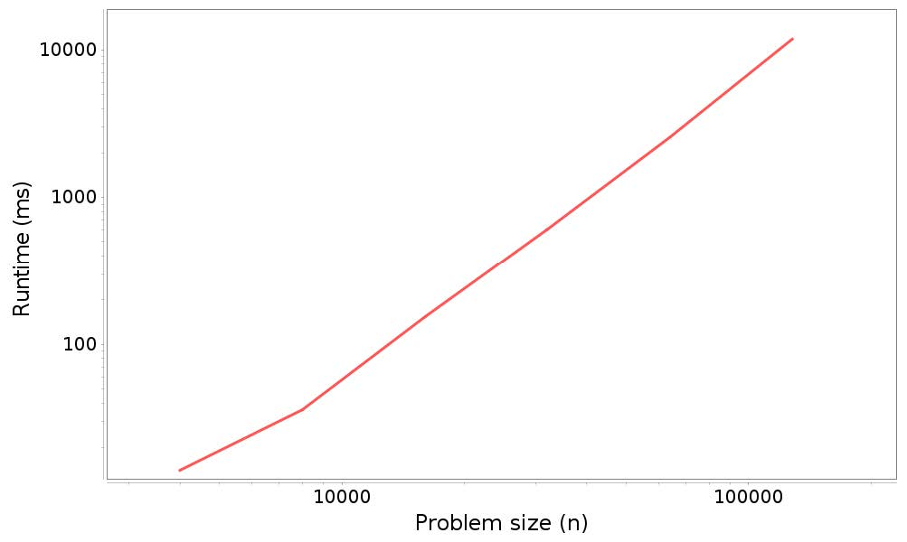
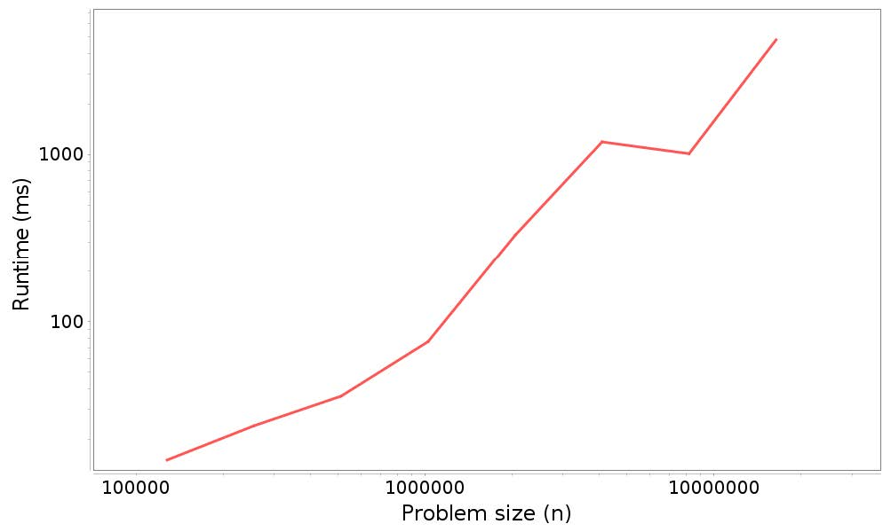
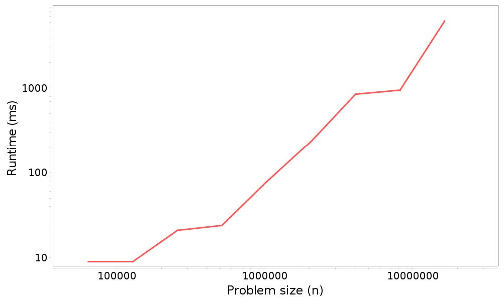

# 第五章 双链表

> 原文：[Chapter 5  Doubly-linked list](http://greenteapress.com/thinkdast/html/thinkdast006.html)

> 译者：[飞龙](https://github.com/wizardforcel)

> 协议：[CC BY-NC-SA 4.0](http://creativecommons.org/licenses/by-nc-sa/4.0/)

> 自豪地采用[谷歌翻译](https://translate.google.cn/)

本章回顾了上一个练习的结果，并介绍了`List`接口的另一个实现，即双链表。

## 5.1 性能分析结果

在之前的练习中，我们使用了`Profiler.java`，运行`ArrayList`和`LinkedList`的各种操作，它们具有一系列的问题规模。我们将运行时间与问题规模绘制在重对数比例尺上，并估计所得曲线的斜率，它表示运行时间和问题规模之间的关系的主要指数。

例如，当我们使用`add`方法将元素添加到`ArrayList`的末尾，我们发现，执行`n`次添加的总时间正比于`n`。也就是说，估计的斜率接近`1`。我们得出结论，执行`n`次添加是 `O(n)`的，所以平均来说，单个添加的时间是常数时间，或者`O(1)`，基于算法分析，这是我们的预期。


这个练习要求你填充`profileArrayListAddBeginning`的主体，它测试了，在`ArrayList`头部添加一个新的元素的性能。根据我们的分析，我们预计每个添加都是线性的，因为它必须将其他元素向右移动；所以我们预计，`n`次添加是平方复杂度。


这是一个解决方案，你可以在仓库的`solution`目录中找到它。

```java
public static void profileArrayListAddBeginning() {
    Timeable timeable = new Timeable() {
        List<String> list;

        public void setup(int n) {
            list = new ArrayList<String>();
        }

        public void timeMe(int n) {
            for (int i=0; i<n; i++) {
                list.add(0, "a string");
            }
        }
    };
    int startN = 4000;
    int endMillis = 10000;
    runProfiler("ArrayList add beginning", timeable, startN, endMillis);
}
```

这个方法几乎和`profileArrayListAddEnd`相同。唯一的区别在于`timeMe`，它使用`add`的双参数版本，将新元素置于下标`0`处。同样，我们增加了`endMillis`，来获取一个额外的数据点。

以下是时间结果（左侧是问题规模，右侧是运行时间，单位为毫秒）：

```
4000, 14
8000, 35
16000, 150
32000, 604
64000, 2518
128000, 11555
```

图 5.1 展示了运行时间和问题规模的图形。



图 5.1：分析结果：在`ArrayList`开头添加`n`个元素的运行时间和问题规模

请记住，该图上的直线并不意味着该算法是线性的。相反，如果对于任何指数`k`，运行时间与`n ** k`成正比，我们预计会看到斜率为`k`的直线。在这种情况下，我们预计，`n`次添加的总时间与`n ** 2`成正比，所以我们预计会有一条斜率为`2`的直线。实际上，估计的斜率是`1.992`，非常接近。恐怕假数据才能做得这么好。

## 5.2 分析`LinkedList`方法的性能

在以前的练习中，你还分析了，在`LinkedList`头部添加新元素的性能。根据我们的分析，我们预计每个`add`都要花时间，因为在一个链表中，我们不必转移现有元素；我们可以在头部添加一个新节点。所以我们预计`n`次添加的总时间是线性的。


这是一个解决方案：

```java
public static void profileLinkedListAddBeginning() {
    Timeable timeable = new Timeable() {
        List<String> list;

        public void setup(int n) {
            list = new LinkedList<String>();
        }

        public void timeMe(int n) {
            for (int i=0; i<n; i++) {
                list.add(0, "a string");
            }
        }
    };
    int startN = 128000;
    int endMillis = 2000;
    runProfiler("LinkedList add beginning", timeable, startN, endMillis);
}
```

我们只做了一些修改，将`ArrayList`替换为`LinkedList`并调整`startN`和`endMillis`，来获得良好的数据范围。测量结果比上一批数据更加嘈杂；结果如下：

```
128000, 16
256000, 19
512000, 28
1024000, 77
2048000, 330
4096000, 892
8192000, 1047
16384000, 4755
```

图 5.2 展示了这些结果的图形。



图 5.2：分析结果：在`LinkedList`开头添加`n`个元素的运行时间和问题规模

并不是一条很直的线，斜率也不是正好是`1`，最小二乘拟合的斜率是`1.23`。但是结果表示，`n`次添加的总时间至少近似于`O(n)`，所以每次添加都是常数时间。

## 5.3 `LinkedList`的尾部添加

在开头添加元素是一种操作，我们期望`LinkedList`的速度快于`ArrayList`。但是为了在末尾添加元素，我们预计`LinkedList`会变慢。在我的实现中，我们必须遍历整个列表来添加一个元素到最后，它是线性的。所以我们预计`n`次添加的总时间是二次的。

但是不是这样。以下是代码：

```
public static void profileLinkedListAddEnd() {
    Timeable timeable = new Timeable() {
        List<String> list;

        public void setup(int n) {
            list = new LinkedList<String>();
        }

        public void timeMe(int n) {
            for (int i=0; i<n; i++) {
                list.add("a string");
            }
        }
    };
    int startN = 64000;
    int endMillis = 1000;
    runProfiler("LinkedList add end", timeable, startN, endMillis);
}
```

这里是结果：

```
64000, 9
128000, 9
256000, 21
512000, 24
1024000, 78
2048000, 235
4096000, 851
8192000, 950
16384000, 6160
```

图 5.3 展示了这些结果的图形。



图 5.2：分析结果：在`LinkedList`末尾添加`n`个元素的运行时间和问题规模

同样，测量值很嘈杂，线不完全是直的，但估计的斜率为`1.19`，接近于在头部添加元素，而并不非常接近`2`，这是我们根据分析的预期。事实上，它接近`1`，这表明在尾部添加元素是常数元素。这是怎么回事？

## 5.4 双链表

我的链表实现`MyLinkedList`，使用单链表；也就是说，每个元素都包含下一个元素的链接，并且`MyArrayList`对象本身具有第一个节点的链接。


但是，如果你阅读`LinkedList`的文档，网址为 <http://thinkdast.com/linked>，它说：

> `List`和`Deque`接口的双链表实现。[...] 所有的操作都能像双向列表那样执行。索引该列表中的操作将从头或者尾遍历列表，使用更接近指定索引的那个。

如果你不熟悉双链表，你可以在 <http://thinkdast.com/doublelist> 上阅读更多相关信息，但简称为：

+   每个节点包含下一个节点的链接和上一个节点的链接。
+   `LinkedList`对象包含指向列表的第一个和最后一个元素的链接。

所以我们可以从列表的任意一端开始，并以任意方向遍历它。因此，我们可以在常数时间内，在列表的头部和末尾添加和删除元素！

下表总结了`ArrayList`，`MyLinkedList`（单链表）和`LinkedList`（双链表）的预期性能：


|   | `MyArrayList` | `MyLinkedList` | `LinkedList` |
| --- | --- | --- | --- |
| `add`（尾部） | 1 | n | 1 |
| `add`（头部） | n | 1 | 1 |
| `add`（一般） | n | n | n |
| `get`/`set` | 1 | n | n |
| `indexOf`/ `lastIndexOf` | n | n | n |
| `isEmpty`/`size` | 1 | 1 | 1 |
| `remove`（尾部） | 1 | n | 1 |
| `remove`（头部） | n | 1 | 1 |
| `remove`（一般） | n | n | n |

## 5.5 结构的选择

对于头部插入和删除，双链表的实现优于`ArrayList`。对于尾部插入和删除，都是一样好。所以，`ArrayList`唯一优势是`get`和`set`，链表中它需要线性时间，即使是双链表。

如果你知道，你的应用程序的运行时间取决于`get`和`set`元素的所需时间，则`ArrayList`可能是更好的选择。如果运行时间取决于在开头或者末尾附加添加和删除元素，`LinkedList`可能会更好。


但请记住，这些建议是基于大型问题的增长级别。还有其他因素要考虑：

+   如果这些操作不占用你应用的大部分运行时间 - 也就是说，如果你的应用程序花费大部分时间来执行其他操作 - 那么你对`List`实现的选择并不重要。
+   如果你正在处理的列表不是很大，你可能无法获得期望的性能。对于小型问题，二次算法可能比线性算法更快，或者线性可能比常数时间更快。而对于小型问题，差异可能并不重要。
+   另外，别忘了空间。到目前为止，我们专注于运行时间，但不同的实现需要不同的空间。在`ArrayList`中，这些元素并排存储在单个内存块中，所以浪费的空间很少，并且计算机硬件通常在连续的块上更快。在链表中，每个元素需要一个节点，带有一个或两个链接。链接占用空间（有时甚至超过数据！），并且节点分散在内存中，硬件效率可能不高。

总而言之，算法分析为数据结构的选择提供了一些指南，但只有：

+   你的应用的运行时间很重要，
+   你的应用的运行时间取决于你选择的数据结构，以及，
+   问题的规模足够大，增长级别实际上预测了哪个数据结构更好。

作为一名软件工程师，在较长的职业生涯中，你几乎不必考虑这种情况。
