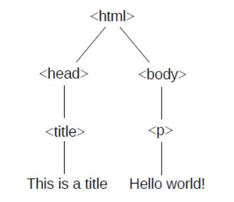
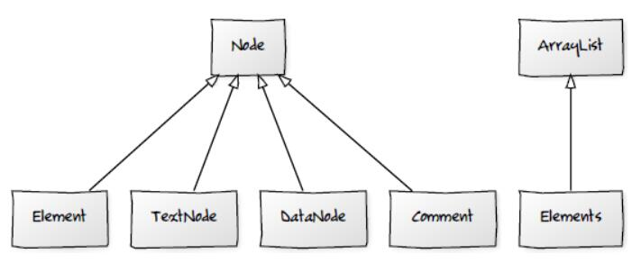

# 第六章 树的遍历

> 原文：[Chapter 6  Tree traversal](http://greenteapress.com/thinkdast/html/thinkdast007.html)

> 译者：[飞龙](https://github.com/wizardforcel)

> 协议：[CC BY-NC-SA 4.0](http://creativecommons.org/licenses/by-nc-sa/4.0/)

> 自豪地采用[谷歌翻译](https://translate.google.cn/)

本章将介绍一个 Web 搜索引擎，我们将在本书其余部分开发它。我描述了搜索引擎的元素，并介绍了第一个应用程序，一个从维基百科下载和解析页面的 Web 爬行器。本章还介绍了深度优先搜索的递归实现，以及迭代实现，它使用 Java`Deque`实现“后入先出”的栈。

## 6.1 搜索引擎

网络搜索引擎，像谷歌搜索或 Bing，接受一组“检索项”，并返回一个网页列表，它们和这些项相关（之后我将讨论“相关”是什么意思）。你可以在 <http://thinkdast.com/searcheng> 上阅读更多内容，但是我会解释你需要什么。

搜索引擎的基本组成部分是：

抓取：我们需要一个程序，可以下载网页，解析它，并提取文本和任何其他页面的链接。
索引：我们需要一个数据结构，可以查找一个检索项，并找到包含它的页面。
检索：我们需要一种方法，从索引中收集结果，并识别与检索项最相关的页面。

我们以爬虫开始。爬虫的目标是查找和下载一组网页。对于像 Google 和 Bing 这样的搜索引擎，目标是查找所有网页，但爬虫通常仅限于较小的域。在我们的例子中，我们只会读取维基百科的页面。

作为第一步，我们将构建一个读取维基百科页面的爬虫，找到第一个链接，并跟着链接来到另一个页面，然后重复。我们将使用这个爬虫来测试“到达哲学”的猜想，它是：

> 点击维基百科文章正文中的第一个小写的链接，然后对后续文章重复这个过程，通常最终会到达“哲学”的文章。

这个猜想在 <http://thinkdast.com/getphil> 中阐述，你可以阅读其历史。

测试这个猜想需要我们构建爬虫的基本部分，而不必爬取整个网络，甚至是所有维基百科。而且我觉得这个练习很有趣！

在几个章节之内，我们将处理索引器，然后我们将到达检索器。

## 6.2 解析 HTML

当你下载网页时，内容使用超文本标记语言（即 HTML）编写。例如，这里是一个最小的 HTML 文档：

```html
<!DOCTYPE html>
<html>
  <head>
    <title>This is a title</title>
  </head>
  <body>
    <p>Hello world!</p>
  </body>
</html>
```

短语`This is a title`和`Hello world!`是实际出现在页面上的文字；其他元素是指示文本应如何显示的标签。

当我们的爬虫下载页面时，它需要解析 HTML，以便提取文本并找到链接。为此，我们将使用`jsoup`，它是一个下载和解析 HTML 的开源 Java 库。

解析 HTML 的结果是文档对象模型（DOM）树，其中包含文档的元素，包括文本和标签。树是由节点组成的链接数据结构；节点表示文本，标签和其他文档元素。

节点之间的关系由文档的结构决定。在上面的例子中，第一个节点称为根，是`<html>`标签，它包含指向所包含两个节点的链接， `<head>`和`<body>`；这些节点是根节点的子节点。

`<head>`节点有一个子节点，`<title>`，`<body>`节点有一个子节点， `<p>`（代表“段落”）。图 6.1 以图形方式表示该树。



图 6.1 简单 HTML 页面的 DOM 树

每个节点包含其子节点的链接; 此外，每个节点都包含其父节点的链接，所以任何节点都可以向上或向下浏览树。实际页面的 DOM 树通常比这个例子更复杂。

大多数网络浏览器提供了工具，用于检查你正在查看的页面的 DOM。在 Chrome 中，你可以右键单击网页的任何部分，然后从弹出的菜单中选择`Inspect`（检查）。在 Firefox 中，你可以右键单击并从菜单中选择`Inspect Element`（检查元素）。Safari 提供了一个名为 Web Inspector 的工具，你可以阅读 <http://thinkdast.com/safari>。对于 Internet Explorer，你可以阅读 <http://thinkdast.com/explorer> 上的说明 。


图 6.2：Chrome DOM 查看器的截图

图 6.2 展示了维基百科 Java 页面（<http://thinkdast.com/java>）的 DOM 截图。高亮的元素是文章正文的第一段，它包含在一个`<div>`元素中 ，带有`id="mw-content-text"`。我们将使用这个元素 ID 来标识我们下载的每篇文章的正文。

## 6.3 使用`jsoup`

`jsoup`非常易于下载，和解析 Web 页面，以及访问 DOM 树。这里是一个例子：

```java
String url = "http://en.wikipedia.org/wiki/Java_(programming_language)";

// download and parse the document
Connection conn = Jsoup.connect(url);
Document doc = conn.get();

// select the content text and pull out the paragraphs.
Element content = doc.getElementById("mw-content-text");
Elements paragraphs = content.select("p");
```

`Jsoup.connect`接受`String`形式的`url`，并连接 Web 服务器。`get`方法下载 HTML，解析，并返回`Document`对象，他表示 DOM。

`Document`提供了导航树和选择节点的方法。其实它提供了很多方法，可能会把人搞晕。此示例演示了两种选择节点的方式：

+   `getElementById`接受`String`并在树中搜索匹配`id`字段的元素。在这里，它选择节点`<div id="mw-content-text" lang="en" dir="ltr" class="mw-content-ltr">`，它出现在每个维基页面上，来确定包含文章正文的`<div>`元素，而不是导航边栏和其他元素。`getElementById`的返回值是一个`Element`对象，代表这个`<div>`，并包含`<div>`中的元素作为后继节点。
+   `select`接受`String`，遍历树，并返回与所有元素，它的标签与`String`匹配。在这个例子中，它返回所有`content`中的段落标签。返回值是一个`Elements`对象。

> 译者注：`select`方法接受 CSS 选择器，不仅仅能按照标签选择。请见 <https://jsoup.org/apidocs/org/jsoup/select/Selector.html>。

在你继续之前，你应该仔细阅读这些类的文档，以便知道他们能做什么。最重要的类是`Element`，`Elements`和`Node`，你可以阅读 <http://thinkdast.com/jsoupelt>，<http://thinkdast.com/jsoupelts> 和 <http://thinkdast.com/jsoupnode>。

`Node`表示 DOM 树中的一个节点；有几个扩展`Node`的子类，其中包括 `Element`，`TextNode`，`DataNode`，和`Comment`。`Elements`是`Element`对象的`Collection`。



图 6.3：被选类的 UML 图，由`jsoup`提供。编辑：<ttp://yuml.me/edit/4bc1c919>

图 6.3 是一个 UML 图，展示了这些类之间的关系。在 UML 类图中，带有空心箭头的线表示一个类继承另一个类。例如，该图表示`Elements`继承`ArrayList`。我们将在第 11.6 节中再次接触 UML 图。

## 6.4 遍历 DOM

为了使你变得更轻松，我提供了一个`WikiNodeIterable`类，可以让你遍历 DOM 树中的节点。以下是一个示例，展示如何使用它：

```java
Elements paragraphs = content.select("p");
Element firstPara = paragraphs.get(0);

Iterable<Node> iter = new WikiNodeIterable(firstPara);
for (Node node: iter) {
    if (node instanceof TextNode) {
        System.out.print(node);
    }
}
```

这个例子紧接着上一个例子。它选择`paragraphs`中的第一个段落，然后创建一个`WikiNodeIterable`，它实现`Iterable<Node>`。`WikiNodeIterable`执行“深度优先搜索”，它按照它们将出现在页面上的顺序产生节点。

在这个例子中，仅当`Node`是`TextNode`时，我们打印它，并忽略其他类型的`Node`，特别是代表标签的`Element`对象。结果是没有任何标记的 HTML 段落的纯文本。输出为：

```
Java is a general-purpose computer programming language that is concurrent, class-based, object-oriented,[13] and specifically designed …
```

> Java 是一种通用的计算机编程语言，它是并发的，基于类的，面向对象的，[13] 和特地设计的...

## 6.5 深度优先搜索

有几种方式可以合理地遍历一个树，每个都有不同的应用。我们从“深度优先搜索”（DFS）开始。DFS 从树的根节点开始，并选择第一个子节点。如果子节点有子节点，则再次选择第一个子节点。当它到达没有子节点的节点时，它回溯，沿树向上移动到父节点，在那里它选择下一个子节点，如果有的话；否则它会再次回溯。当它探索了根节点的最后一个子节点，就完成了。

有两种常用的方式来实现 DFS，递归和迭代。递归实现简单优雅：

```java
private static void recursiveDFS(Node node) {
    if (node instanceof TextNode) {
        System.out.print(node);
    }
    for (Node child: node.childNodes()) {
        recursiveDFS(child);
    }
}
```

这个方法对树中的每一个`Node`调用，从根节点开始。如果`Node`是一个`TextNode`，它打印其内容。如果`Node`有任何子节点，它会按顺序在每一个子节点上调用`recursiveDFS`。

在这个例子中，我们在遍历子节点之前打印每个`TextNode`的内容，所以这是一个“前序”遍历的例子。你可以在 <http://thinkdast.com/treetrav> 上了解“前序”，“后序”和“中序”遍历。对于此应用程序，遍历顺序并不重要。

通过进行递归调用，`recursiveDFS`使用调用栈（<http://thinkdast.com/callstack>）来跟踪子节点并以正确的顺序处理它们。作为替代，我们可以使用栈数据结构自己跟踪节点；如果我们这样做，我们可以避免递归并迭代遍历树。

## 6.6 Java 中的栈

在我解释 DFS 的迭代版本之前，我将解释栈数据结构。我们将从栈的一般概念开始，我将使用小写`s`指代“栈”。然后我们将讨论两个 Java`interfaces`，它们定义了栈的方法：`Stack`和`Deque`。

栈是与列表类似的数据结构：它是维护元素顺序的集合。栈和列表之间的主要区别是栈提供的方法较少。在通常的惯例中，它提供：

`push`：它将一个元素添加到栈顶。
`pop`：它从栈中删除并返回最顶部的元素。
`peek`：它返回最顶部的元素而不修改栈。
`isEmpty`：表示栈是否为空。
因为`pop`总是返回最顶部的元素，栈也称为 LIFO，代表“后入先出”。栈的替代品是“队列”，它返回的元素顺序和添加顺序相同；即“先入先出（FIFO）。

为什么栈和队列是有用的，可能不是很明显：它们不提供任何列表没有的功能；实际上它们提供的功能更少。那么为什么不使用列表的一切？有两个原因：

+   如果你将自己限制于一小部分方法 - 也就是小型 API - 你的代码将更加易读，更不容易出错。例如，如果使用列表来表示栈，则可能会以错误的顺序删除元素。使用栈 API，这种错误在字面上是不可能的。避免错误的最佳方法是使它们不可能。
+   如果一个数据结构提供了小型 API，那么它更容易实现。例如，实现栈的简单方法是单链表。当我们压入一个元素时，我们将它添加到列表的开头；当我们弹出一个元素时，我们在开头删除它。对于链表，在开头添加和删除是常数时间的操作，因此这个实现是高效的。相反，大型 API 更难实现高效。

为了在 Java 中实现栈，你有三个选项：

+   继续使用`ArrayList`或`LinkedList`。如果使用`ArrayList`，请务必从最后添加和删​​除，这是一个常数时间的操作。并且小心不要在错误的地方添加元素，或以错误的顺序删除它们。
+   Java 提供了一个`Stack`类，它提供了一组标准的栈方法。但是这个类是 Java 的一个旧部分：它与 Java 集合框架不兼容，后者之后才出现。
+   最好的选择可能是使用`Deque`接口的一个实现，如`ArrayDeque`。

`Deque`代表“双向队列”；它应该被发音为“deck”，但有些人叫它“deek”。在 Java 中， `Deque`接口提供`push`，`pop`，`peek`和`isEmpty`，因此你可以将`Deque`用作栈。它提供了其他方法，你可以阅读 <http://thinkdast.com/deque>，但现在我们不会使用它们。

## 6.7 迭代式 DFS

这里是 DFS 的迭代版本，它使用`ArrayDeque`来表示`Node`对象的栈。

```java
private static void iterativeDFS(Node root) {
    Deque<Node> stack = new ArrayDeque<Node>();
    stack.push(root);

    while (!stack.isEmpty()) {
        Node node = stack.pop();
        if (node instanceof TextNode) {
            System.out.print(node);
        }

        List<Node> nodes = new ArrayList<Node>(node.childNodes());
        Collections.reverse(nodes);

        for (Node child: nodes) {
            stack.push(child);
        }
    }
}
```

参数`root`是我们想要遍历的树的根节点，所以我们首先创建栈并将根节点压入它。

循环持续到栈为空。每次迭代，它会从栈中弹出`Node`。如果它得到`TextNode`，它打印内容。然后它把子节点们压栈。为了以正确的顺序处理子节点，我们必须以相反的顺序将它们压栈; 我们通过将子节点复制成一个`ArrayList`，原地反转元素，然后遍历反转的`ArrayList`。

DFS 的迭代版本的一个优点是，更容易实现为 Java`Iterator`；你会在下一章看到如何实现。

但是首先，有一个`Deque`接口的最后的注意事项：除了`ArrayDeque`，Java 提供另一个`Deque`的实现，我们的老朋友`LinkedList`。`LinkedList`实现两个接口，`List`和`Deque`（还有`Queue`）。你得到哪个接口，取决于你如何使用它。例如，如果将`LinkedList`对象赋给`Deque`变量，如下所示：

```java
Deqeue<Node> deque = new LinkedList<Node>();
```

你可以使用`Deque`接口中的方法，但不是所有`List`中的方法。如果你将其赋给`List`变量，像这样：

```java
List<Node> deque = new LinkedList<Node>();
```

你可以使用`List`接口中的方法，但不是所有`Deque`中的方法。并且如果像这样赋值：

```java
LinkedList<Node> deque = new LinkedList<Node>();
```

你可以使用所有方法，但是混合了来自不同接口的方法。你的代码会更不可读，并且更易于出错。
